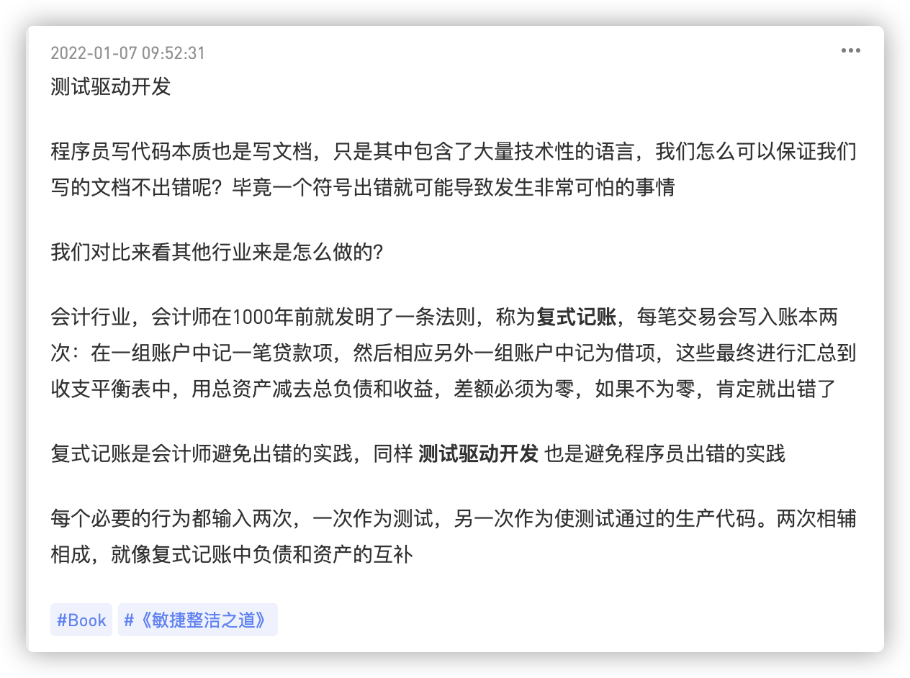

# 1. 敏捷开发的流程
- 需求分析和评估（requirements analysis）
- 设计（design）
- 编码（coding）
- 测试（testing）
- 部署和评估（回顾会）（deployment / evaluation）

## 2. sprint当中的细节

- 故事点：
   - 估算的单位是故事点，大致可以把一个一个故事点认为是 人/天 的工作量
   - 不过不一定说就是20个故事点，就20人/天一定能够完成，这里面还要考虑到大家的投入度
- 索引卡：
   - 使用索引卡第一是为了把故事拆成一个个任务，方便看到进度，以及估算故事点变得更加准确
   - 用索引卡来开会，比用电脑更加加强大家的参与感
   - 索引卡开完sprint会后可以直接用来贴在看板上
- 完成：
   - 完成的定义应该是随时可以上线，而不是处于开发测试的阶段
- 扑克牌玩法：
   - 定义：大家通过打扑克的方法来估算某个故事所需要的故事点数
   - 信息同步：用扑克牌这种估算方法是为了可以让大家消除信息差，避免出现A认为这个很简单，但是其实从B的角度来说，这个里面可能会很难，反之亦然
   - 从团队的角度思考：估算的时候是估算整个团队所需要的时间，而不是自己负责的模块所需要的时间
   - 加强对于故事的理解：由于需要自己去估算，所以会对整个故事有更深的理解
- 每日例会
   - 更加偏向于每日早上快速的过一遍，不选择下午是因为，知道今天要做什么不，比知道你已经干了什么更加重要
   - 可以选择从人的维度过，也可以选择从故事的维度过，这个具体团队具体分析
- 技术故事
   - 说出为什么要做这个技术故事，他可以为我么后面带来怎么样的效率提高
- 燃尽图
   - 通过燃尽图我们可以知道，是否需要新加入一些用户故事，或者说可以移除一些用户故事
- 演示-用处
   - 做演示，正面可以激发大家的成就感，反面也可以刺激大家进行更好的完成用户故事
   - 同时可以让相关利益干系人知道作了什么，是不是真的是他们想要的
   - 其他人可以知道我们在做什么
   - 因为要演示，所以可以避免一种情况也就是说完成进度卡在百分之99，解决拖延症++
- 演示-注意的点
   - 从用户的角度去演示，要上下很顺畅的感觉
   - 对于一些技术演示，可以直接通过文字，或者简单的报告来说达到了一个什么样的目标，比如压测了可以支持10000的并发
   - 演示前可以在会议室进行一次实验，避免仪器什么的没有调试好
# 2. 关于敏捷的需求管理

- 理想中的敏捷开发？
   - 统一的产品待办事项 (Single Backlog）：这个是基础
   - 价值导向：应该是给客户的提供的价值为导向
   - 小步发布：把用户故事拆的足够小，保证可以每一个sprint可以做完一些有价值的用户故事
- boss说的需求一定要做？怎么破
   - 本质上想要的是什么？老板说要学习友商的XXX，可能是要我们分析清楚背后的逻辑、重视相关趋势，未必就是也要去实现同样的功能。不要只听表面，同理到老板/用户真正的意图，澄清挖掘到真正的问题，针对老板的目的，提出针对问题的专业解决方案（即要把老板需求翻译成真正的用户需求以及产品需求）。然后自己有一个主张，且有备选方案的情况下去和boss讨论，得到一个结论

# 3. 极限编程

- TDD 测试驱动开发意味着先写测试用例，然后再进行编码，然后再基于测试用例去优化代码
- TDD 的教训： 如果深陷手工回归测试的问题，打算自动化执行的话，最好还是放弃，我们想的应该是先通过一些自动化操作来对手动回归测试进行优化，而不是一下就做到全部自动化测试
- 自动化测试：尽量多的用自动化测试，而不是手动回归测试
- 单元测试的一个不同角度的看法：

# 4. scrum 对比 kanban 

- 记忆深刻的一个点，就是对于WIP（work in progress）的设定，应该是 （2n - 1），对于n是团队的人数，2n代表每个有一个正在做的事情，以及接下来要做的事情。-1是为了沟通和协作
- scrum 和 kanban的一个对比图

# 5. 敏捷开发的十二个原则

1. 通过早期和持续交付有价值的软件，实现客户满意度。
2. 欢迎不断变化的需求，即使是在项目开发的后期。要善于利用需求变更，帮助客户获得竞争优势。
3. 不断交付可用的软件，周期通常是几周，越短越好。
4. 项目过程中，业务人员与开发人员必须在一起工作。
5. 项目必须围绕那些有内在动力的个人而建立，他们应该受到信任。
6. 面对面交谈是最好的沟通方式。
7. 可用性是衡量进度的主要指标。
8. 提倡可持续的开发，保持稳定的进展速度。
9. 不断关注技术是否优秀，设计是否良好。
10. 简单性至关重要，尽最大可能减少不必要的工作。
11. 最好的架构、要求和设计，来自团队内部自发的认识。
12. 团队要定期反思如何更有效，并相应地进行调整。
