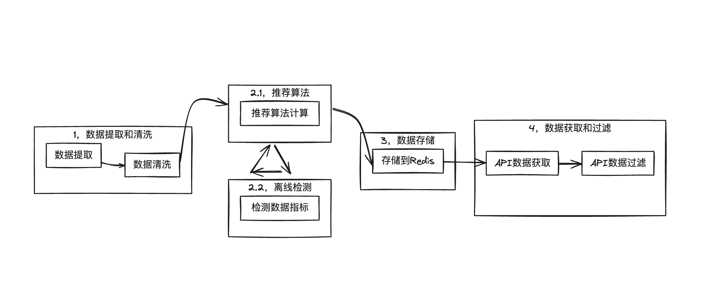

写这篇博客的背景是考虑到可能有很多公司并不会说真的上一套完全的自动化模型训练，自动化发布，所以往往可能最简单的推荐算法就是直接用 Python 进行实现，所以在这里对自己做这个工程化（基于内容的推荐算法）中间踩过的坑做一个记录。

# 工程化整体框架
假设业务背景：豆瓣给用户推荐兴趣小组逻辑。


# 工程化中遇到的问题
## 数据提取阶段耗时长
**增量加载**
这里用户数据和小组数据，都需要从数据库中提取，而由于帖子数据有千万，所以每次从数据库中加载颇为耗时，后续这里改为了增量加载，每天只加载昨天新增的数据。老的数据则进行缓存处理。
## 数据清洗阶段速度过慢
**多进程处理：**加载完数据后，我们需要对帖子进行数据清洗、分词处理这两个操作及其耗费时间（会把CPU跑满），这里对其进行改造为多进程**。**

**缓存处理：**大部分主题内容是不会有什么变动的，所以前一天跑出来的清洗和分词结果可以进行缓存，从而只需要对新增数据进行新增处理。
## 计算阶段内存爆炸
**限制进程数量**：由于发现很多计算慢的地方都是因为python只能利用到单核CPU，所以很多地方就改成了多进程，进而可以利用多核的性能，但是发现这里会存在一个问题就是每一个进程会启动一个python解释器，以及复制计算数据，导致内存溢出，所以这里要合理进行限制进程数量。

**数据类型优化**：构建部分数据矩阵的时候发现默认使用的是int64，但其实可以改为使用int32，进一步降低内存。甚至在部分算法中使用one-hot编码的时候，我们可以使用bool类型。

**分批计算**：部分计算的时候会一次把所有的用户进行计算，但其实可以分批计算，从而降低内存占用。举例说明一下吧。（备注：下面的代码如果不分批计算，一次性进行consine_similarity计算会占用大量内存，从而导致内存爆炸）
```python
def batch_compute_cosine_similarity(user_df, group_df):
    sort_batch_similarity_list = []
    batch_size = 2000
    if user_df.shape[0] < batch_size:
        batch_size = user_df.shape[0]

    user_df_list = np.array_split(user_df, batch_size)
    for index, u_df in tqdm(enumerate(user_df_list)):
        # 计算当前批次的相似度矩阵
        batch_similarity = cosine_similarity(u_df,
                                             group_df)  # 这里cosine_similarity可以输入CSR矩阵直接计算，后期迭代优化可以考虑使用CSR矩阵是否能节省内存
        if index == 0:
            logger.info(f"相似度矩阵：\n{batch_similarity}")
        sort_batch_similarity = np.argsort(batch_similarity, axis=1)[:, ::-1][:, :300]
        sort_batch_similarity = sort_batch_similarity.astype(np.uint32)
        sort_batch_similarity_list.append(sort_batch_similarity)

    logger.info("将计算好的相似度矩阵拼接在一起")
    sorted_index = np.vstack(sort_batch_similarity_list)
    return sorted_index
```
## 维护阶段python代码过于抽象
**增加参数注释**：python代码本身是弱类型语言，而推荐算法过程中可能会用到挺多复杂的数据结构，如果缺少注释会导致后面维护难度增加。举例下面这个函数，大家倾向于维护哪种风格的代码？
```python
import pandas as pd


def cal_user_recommend_groups(user_df, group_df):
    """"""
# to do something


def cal_user_recommend_groups_v2(user_df: pd.DataFrame, group_df: pd.DataFrame):
    """

    Args:
        user_df: index is user_id, columns are group_id_1, group_id_2, ...
        group_df: index is group_id, columns are tag, text, status, ...

    Returns:

    """
    """"""
# to do something

```

**单元测试**：本质还是因为整体算法可能涉及很多处理数据和计算的地方，而这些处理和计算往往涉及比较抽象的函数调用，如果没有单元测试可能会导致以下这些问题

- 不好理解：一个函数里面很多抽象的pandas函数应用，并且函数又长，理解起来非常费力。
- 不敢重构：函数一长里面方法抽象层次高的话，重构了以后不能立马知道是否有问题，而如果要跑整个代码耗时又长，久而久之就不敢重构只敢往上面加代码。
- 备注：长函数不好写单元测试，所以你要覆盖单元测试自然而然会拆小函数。

**链式调用**：因为pandas提供了很多很好用的函数，而且可以一行代码调用好几个函数进行处理，这种代码写起来很爽，维护起来很惨（天知道还记得那些好用的函数具体是什么效果，何况是链式调用，再叠加如果函数入参没有注释数据结构，那酸爽不敢想象）

原函数
```python
def process_data(df):
    temp_df = df.assign(tag_id=df['tag_id'].str.split(',')).explode('tag_id')[['group_id', 'tag_id']]
    return temp_df
```

优化以后的函数：
```python
def process_data(df):
    """

    Args:
        df:      group_id, tag_id
            0       1,     A,B,C
    Returns:
                   group_id tag_id
        0         1      A
        0         1      B
        0         1      C

    """
    # 首先创建一个新的数据框，保持原来的数据
    df_copy = df.copy()

    # 将'tag_id'列中的字符串按逗号分割，得到一个列表
    df_copy['tag_id'] = df_copy['tag_id'].str.split(',')

    # 使用explode方法，将每个标签列表拆分成多行
    df_exploded = df_copy.explode('tag_id')

    # 只保留'group_id'和'tag_id'列
    return df_exploded[['group_id', 'tag_id']]
```


以上，与其说是推荐系统工程化中遇到的问题，不如说是一些python编码中遇到的问题。如果大家对于python足够熟悉，然后平时比较注意编码规范，对于性能又追求，一般来说就可以避免掉里面绝大部分坑了。
